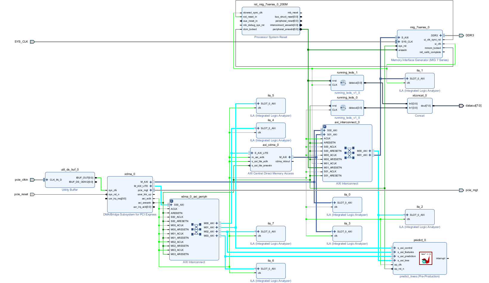
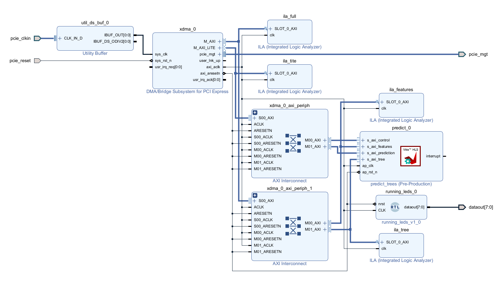
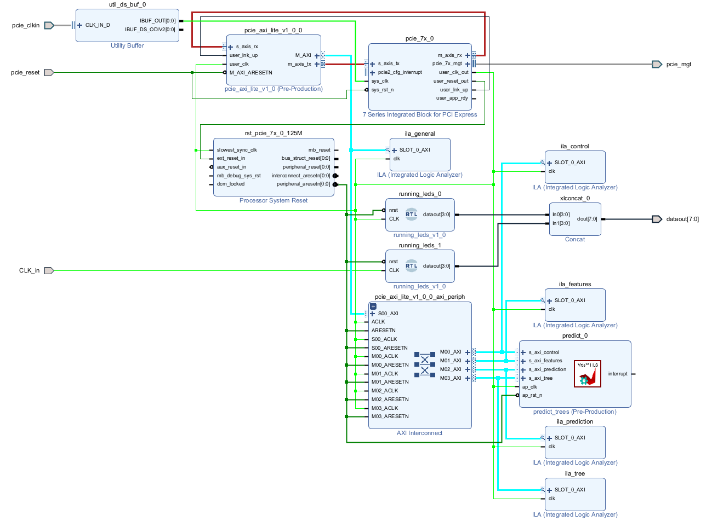

# tfm
This repository contains all the TFM documents and programs.

There are different hardware implementations based on a hardware accelerator that uses “Boosting” type decision trees, trained with LightGBM and converted to hardware using Vitis HLS, followed by subsequent implementation with Vivado.

hardware implementations:


Block design MIG



Block design XDMA


Block design MMIO


There is also an implementation on a GPU with OpenCL for comparison purposes.

```plaintext
├── C_code_vitis: with test and hls code
│   ├── laod_and_execute_model.c
│   ├── predict.c
│   └── predict.h
├── CMakeLists.txt
├── datasets: with the datasets on which to perform the inference
│   ├── alzheimers_disease_data.csv
│   ├── alzheimers_processed_dataset.csv
│   ├── anemia.csv
│   ├── anemia_processed_dataset.csv
│   ├── diabetes.csv
│   ├── Heart_Attack.csv
│   ├── Lung_Cancer_processed_dataset.csv
│   └── Lung_Cancer_raw.csv
├── ips: contains the ips required for vivado block diagrams
│   ├── export.zip
│   └── pcie_axi_lite_IP.zip
├── linux_drivers: contains all the c code to drive fpga from the pcie
│   ├── common: common functions to all the c drivers
│   │   ├── common.c
│   │   └── common.h
│   ├── dma
│   │   ├── defines_dma.h
│   │   └── dma.c
│   ├── memory_mapped
│   │   ├── defines_memoty_mapped.h
│   │   └── memory_mapped.c
│   ├── MIG_2_DDR3_DMA
│   │   ├── defines_dma.h
│   │   └── main.c
│   └── reload_resource.sh
├── openCL: Contains an openCl implementation
│   ├── main.c: openCl implementation
├── python_code: 
│   ├── interface.py: attempt at a graphical interface
│   └── train_model.py: trains the model and exports a binary in a format that allows inferences to be made
├── README.md
├── trained_models: models already generated
│   ├── alzheimers.model
│   ├── anemia.model
│   ├── diabetes.model
│   ├── heart_attack.model
│   └── lung_cancer.model
└── vivado: contains all de bock diagrams in a tcl format so it can be rebuild
    ├── dma
    │   ├── bd.png
    │   ├── constrs_1
    │   │   └── new
    │   │       ├── early.xdc
    │   │       └── normal.xdc
    │   ├── dmadesign_1.tcl
    │   ├── README.md
    │   └── vhdl
    │       └── running_leds.vhd
    ├── memory_mapped
    │   ├── bd.png
    │   ├── constrs_1
    │   │   └── new
    │   │       ├── early.xdc
    │   │       └── normal.xdc
    │   ├── design_1.tcl
    │   ├── README.md
    │   └── vhdl
    │       └── running_leds.vhd
    └── MIG_version
        ├── bd.png
        ├── constrs_1
        │   ├── ddr.xdc
        │   └── new
        │       ├── early.xdc
        │       └── normal.xdc
        ├── design_1.tcl
        ├── MIG_config
        │   ├── design_1_mig_7series_0_0.xci
        │   └── mig_b.prj
        ├── README.md
        └── vhdl
            └── running_leds.vhd
```


hardware implementation tested with the board sitlinv Kintex 7 XC7K325T and 2GB of ddr3 samsung M471B5773DH0-YK0

BOARD


